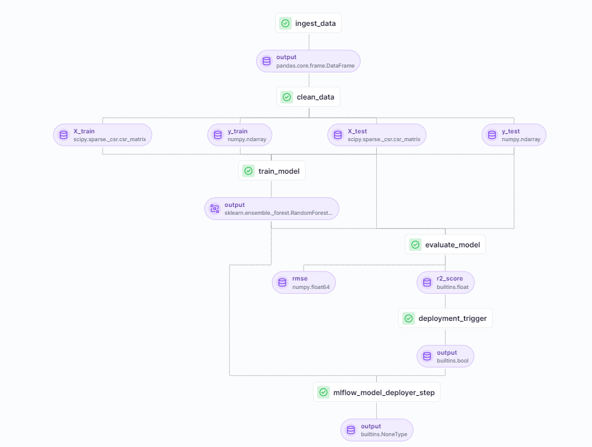

# financial_sentiment_analysis_pipeline



## To setup the repo
```
$ python -m venv venv

# Activate virtual environment
$ venv/Scripts/activate

# Install dependencies
$ pip install -r requirements.txt
```

## To run training pipeline
```
$ py run_pipeline.py
```

## To deploy pipeline
```
$ py run_deployment.py --config deploy
```

## To predict
```
$ py run_deployment.py --config predict
```